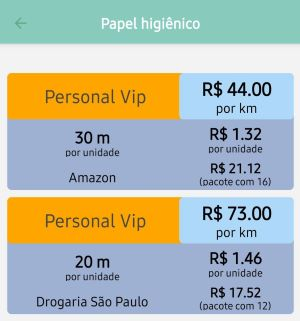
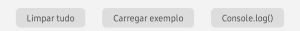

---
hide:
  - navigation
---
# Bem vindo ao teste!

Oi, gente! Tirei umas horinhas da semana passada pra passear pelo mundinho de desenvolvimento de aplicativos... :nerd: Se vocês puderem me ajudar a testá-lo... :pray:

## Objetivo geral do aplicativo

Para cada produto, comparar o preço de diferentes opções, levando em conta a quantidade.

## Exemplo de uso

Você informa que um pacote de papel higiênico custa 30 reais e vem com 24 rolos de 30 metros. Daí o aplicativo calcula o preço por rolo e por metro (ou por quilômetro!), facilitando a comparação de diversas opções de compra.

 

## Instruções gerais

### Instalação

??? info "Só tem para Android, por enquanto..."

     Se não é o seu caso, pode compartilhar com alguém que se interessar. O limite é de 100 usuários para essa fase de teste.

Para testar o aplicativo, você precisa me enviar o seu endereço de **e-email cadastrado na Google Play**. Daí, eu te incluo na lista de testadores e você poderá instalar o aplicativo.

[Enviar endereço de email :material-whatsapp:](https://wa.me/5511983843193?text=Oi!%20Pode%20me%20incluir%20na%20lista%20de%20teste!%20Meu%20e-mail%20na%20Google%20Play%20%C3%A9:){:target="_blank" .md-button .md-button--primary  }

[Baixar app na Google Play :material-google-play: ](https://play.google.com/apps/testing/com.gkaneto.Comparador){:target="_blank" .md-button }

### Versão de teste

Nesta versão de teste, há três botões cinza pequenos na tela inicial:

 

- `Limpar tudo`: apaga todos os dados (tem um alerta para confirmação antes)
- `Carregar exemplo`: adiciona uma lista de produtos e opções bem diversas, para mostrar as possibilidades do aplicativo
- `Console.log`: no celular não faz nada. Mas, quando conectado ao computador, mostra os dados salvos (crus) para conferência

Para começar o teste rapidamente, você pode apertar `Carregar exemplo`.

## Manual de uso do aplicativo

!!! warning "Separador decimal"

    Por enquanto, o aplicativo só aceita ponto com separador decimal, e não vírgula. 

A leitura desta parte é opcional. Tentei manter o aplicativo simples, de modo que as pessoas consigam usá-lo sem manual. (Nem sempre consegui :grimacing::sweat_smile: A parte sobre unidades de medida está meio confusa.)

Para acessar as informações mais completas, vá para a página [Manual de uso](instrucoes.md).

## Como testar, indicar erros e sugerir mudanças

Tem instruções mais detalhadas nesta outra página: [Testando e reportando](teste.md).

## E esse nome???

Eu considero que é um "não nome" ainda. Não tive nenhuma ideia, por ora...

## Próximas versões

Além de corrigir *bugs* e implementar pequenas melhorias, o objetivo maiorzão final é permitir que os dados sejam salvos na nuvem e compartilhados, podendo ser editados e usados por um grupo de pessoas, como no Splitwise. Daí, fica legal pra pessoas que moram juntas ou perto, ou para uso em pequenas empresas, por exemplo.

