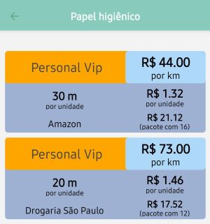

---
hide:
  - navigation
---
# Bem vindo!

Oi, gente! Tirei umas horinhas pra passear pelo mundinho de desenvolvimento de aplicativos... :nerd: Se vocês quiserem usar e avaliar lá na Google Play... :pray:

## Objetivo geral do aplicativo

Para cada produto, comparar o preço de diferentes opções, levando em conta a quantidade.

[Baixar app na Google Play :material-google-play: ](https://play.google.com/store/apps/details?id=com.gkaneto.Comparador){:target="_blank" .md-button }

??? info "Só tem para Android, por enquanto..."

    Se tiver bastante usuário e algum retorno financeiro, daí pode valer a pena abrir uma conta de desenvolvedor pra disponibilizar o app pra iOS...

## Exemplo de uso

Você informa que um pacote de papel higiênico custa 30 reais e vem com 24 rolos de 30 metros. Daí o aplicativo calcula o preço por rolo e por metro (ou por quilômetro!), facilitando a comparação de diversas opções de compra.

 

## Manual de uso do aplicativo

A leitura desta parte é opcional. Tentei manter o aplicativo simples, de modo que as pessoas consigam usá-lo sem manual. (Nem sempre consegui :grimacing::sweat_smile: A parte sobre unidades de medida está meio confusa.)

Para acessar as informações mais completas, vá para a página [Manual de uso](instrucoes.md).

## Como testar, indicar erros e sugerir mudanças

Tem instruções mais detalhadas nesta outra página: [Testando e reportando](teste.md).

## E esse nome???

Eu considero que é um "não nome" ainda. Não tive nenhuma ideia melhor, por ora...

